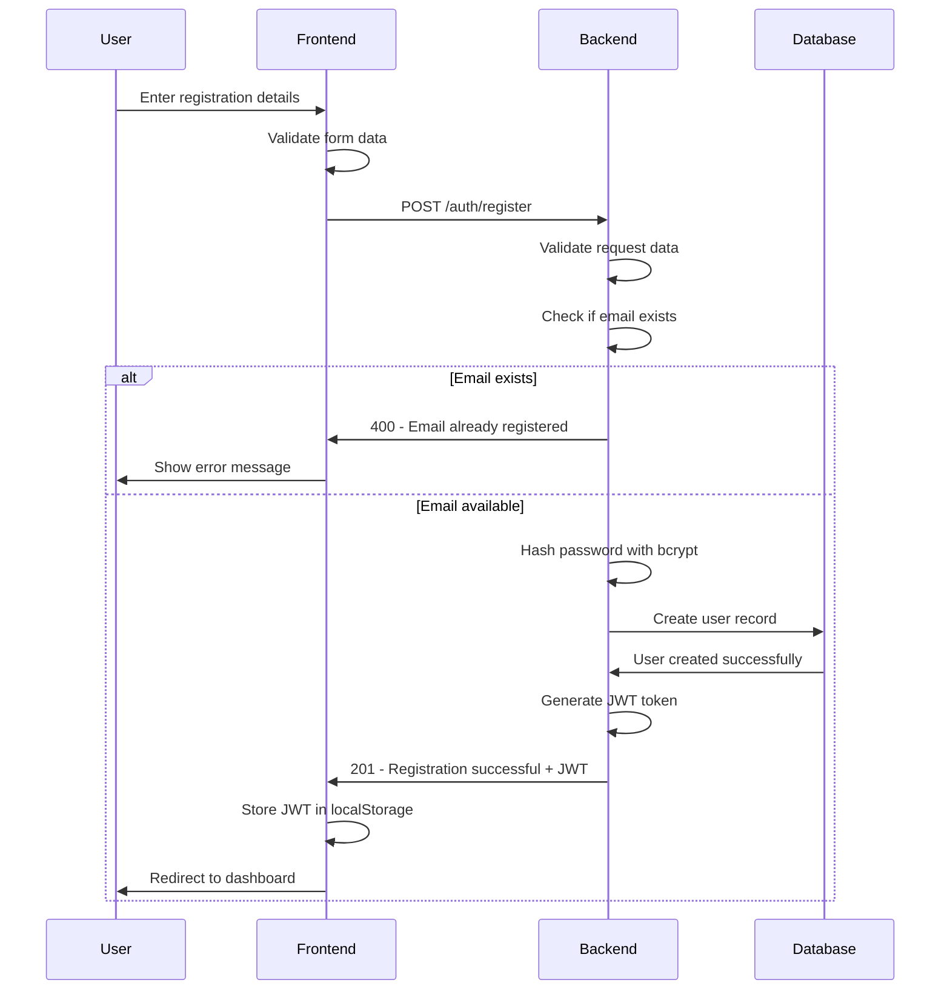
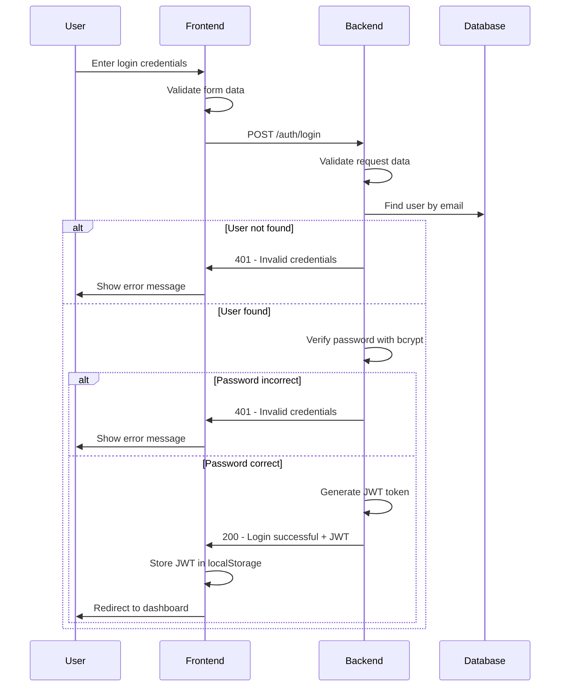
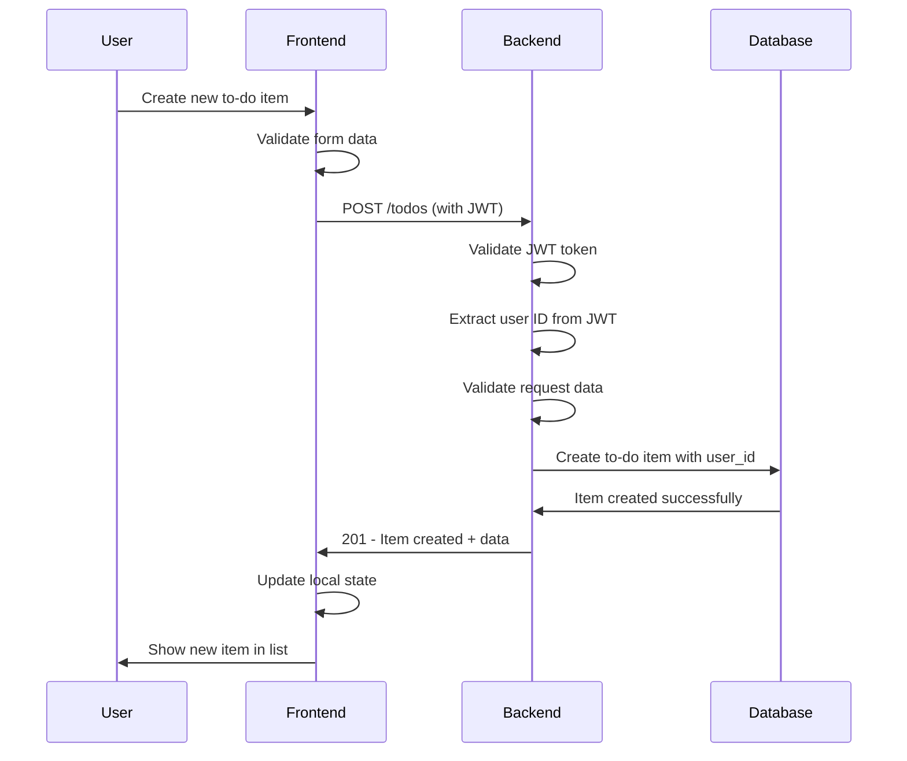
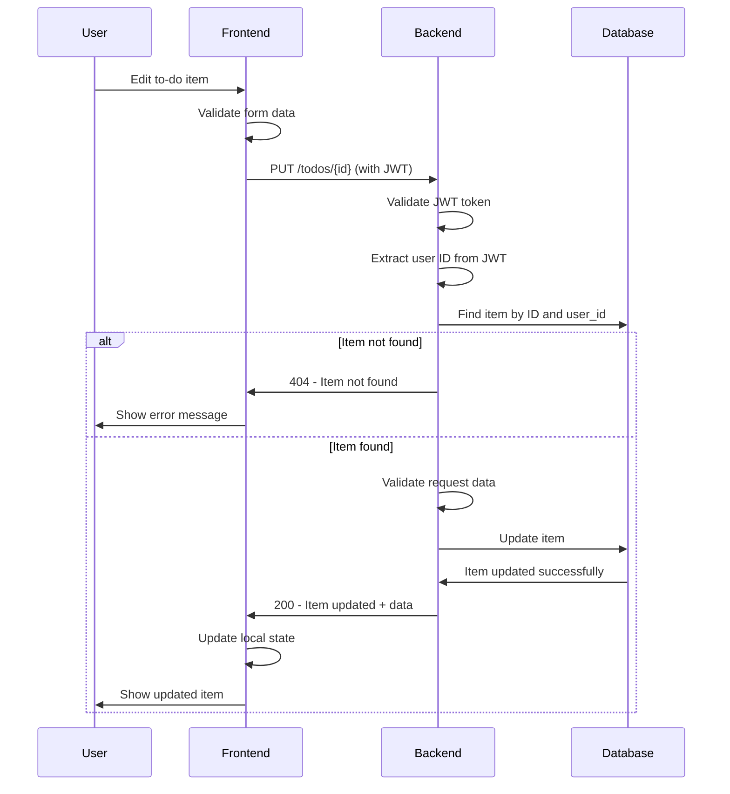
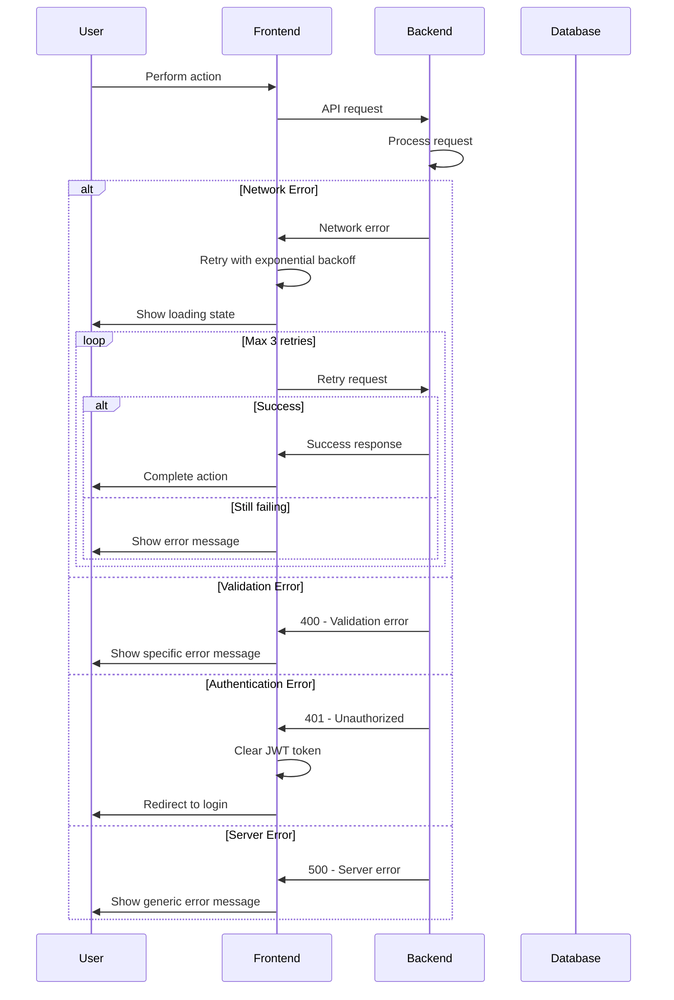
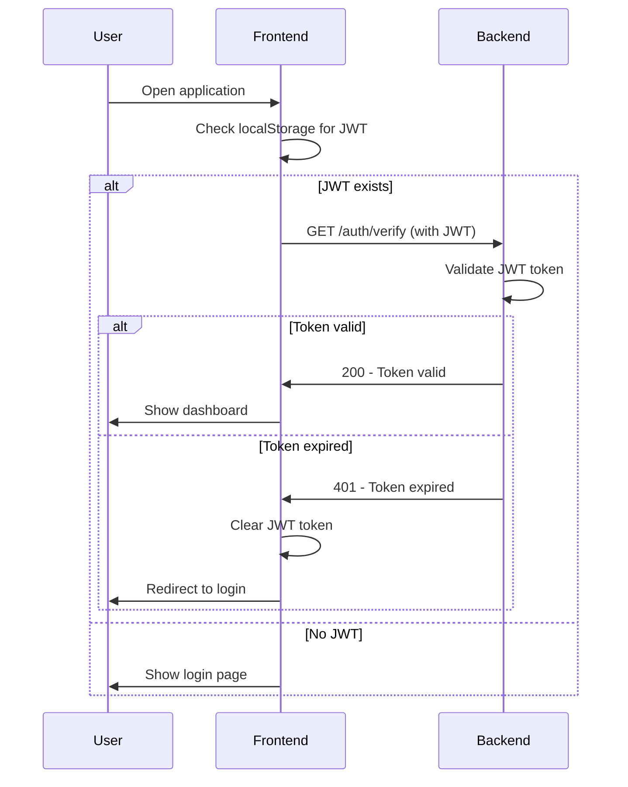

https://www.notion.so/High-Level-Design-HLD-Document-To-Do-List-Web-Application-2326f8eb1c3f80b9ab4bfef329b755e7

# High Level Design (HLD) Document - To-Do List Web Application

## Executive Summary

The To-Do List Web Application project builds a modern, secure web-based task management system that enables users to create accounts, authenticate securely, and manage their personal to-do items with full CRUD operations. The system provides persistent data storage, responsive design, and a clean user interface that works across all modern web browsers and devices.

### Business Value

- **User Productivity**: Streamlined task management with intuitive interface
- **Data Persistence**: User tasks are securely stored and accessible across sessions
- **Security**: Enterprise-grade authentication and data protection
- **Scalability**: Architecture supports growth from hundreds to thousands of users
- **Modern UX**: Clean, responsive design following current web standards

### Technical Solution Overview

- **React Frontend**: Modern single-page application with TypeScript for type safety
- **Node.js Backend (Express)**: Lightweight JavaScript web framework with RESTful API design
- **Sequelize ORM**: For PostgreSQL integration
- **JWT Authentication**: Secure token-based authentication system using jsonwebtoken
- **Validation**: Joi for request validation
- **Password Hashing**: bcryptjs
- **Deployment**: nodemon for development, node for production
- **PostgreSQL Database**: Robust relational database with ACID compliance
- **Cloud Deployment**: Containerized deployment on modern cloud platforms
- **Automated Testing**: Comprehensive test coverage for reliability

### Implementation Plan

The solution will be delivered in 5 vertical shippable features:

- **Feature 1**: User Authentication System
- **Feature 2**: Basic To-Do CRUD Operations  
- **Feature 3**: Session Management & Persistence
- **Feature 4**: Enhanced To-Do Features
- **Feature 5**: Error Handling & Polish

### Key Metrics

- **Response Time**: < 2 seconds for API calls (95th percentile)
- **Uptime**: 99.9% availability
- **User Capacity**: Support 1000+ concurrent users
- **Security**: Zero data breaches, encrypted data at rest and in transit
- **Performance**: Page load times < 3 seconds on standard connections

## Functional Requirements

### Core Requirements

- **User Registration & Authentication**: Secure sign-up, sign-in, and sign-out functionality
- **To-Do Item Management**: Create, read, update, delete, and mark items as complete
- **Data Persistence**: All user data stored securely in database with user isolation
- **Session Management**: Users remain logged in until explicit logout or session expiry
- **Real-time Updates**: Immediate UI updates when data changes

## Assumptions

> **Note:** The following user experience requirements are assumptions made by the engineering team to ensure a high-quality user experience. These were not explicitly stated in the product requirements and are subject to review and approval by stakeholders.

### User Experience Requirements
- Intuitive Interface: Clean, modern design matching provided sketch
- Fast Interactions: Sub-second response times for user actions
- Error Handling: Clear, helpful error messages for all failure scenarios
- Loading States: Visual feedback during data operations
- Accessibility: WCAG 2.1 AA compliance for inclusive design
  - *WCAG 2.1 AA* (Web Content Accessibility Guidelines) is an internationally recognized standard for making web content more accessible to people with disabilities, including those with visual, auditory, motor, or cognitive impairments. Ensuring accessibility is important to provide equal access and usability for all users, improve user experience, and comply with legal and ethical standards.

### Data Management Requirements

- **User Data Isolation**: Each user can only access their own to-do items
- **Data Validation**: Comprehensive input validation and sanitization
- **Data Integrity**: ACID compliance for all database operations
- **Backup & Recovery**: Automated daily database backups will be performed and stored securely in a separate location from the production database. Backups will be retained for 30 days, allowing for point-in-time recovery in case of data loss or corruption. Disaster recovery refers to the ability to restore the application and its data to a consistent state within 4 hours (RTO) in the event of catastrophic failure, such as hardware failure, accidental deletion, or security breach.
- **Data Export**: User ability to export their data (future enhancement)

## Non-Functional Requirements

### Performance Requirements

- **API Response Time**: < 500ms for 95% of requests, < 2s maximum
- **Page Load Time**: < 3 seconds for initial page load
- **Concurrent Users**: Support 1000+ simultaneous users
- **Database Performance**: < 100ms query response time for standard operations
- **Scalability**: Horizontal scaling capability for future growth

### Security Requirements

- **Authentication**: JWT-based secure authentication with configurable expiry
- **Password Security**: bcrypt hashing with salt rounds
  - *bcrypt* is a password hashing function designed to be computationally intensive, making it resistant to brute-force attacks. It automatically incorporates a salt (random data) and allows configuration of the number of hashing rounds, further increasing security. Using bcrypt ensures that even if the password database is compromised, attackers cannot easily recover the original passwords.
- **Data Encryption**: TLS 1.3 for data in transit, AES-256 for data at rest
  - *TLS 1.3* (Transport Layer Security) is the latest standard protocol for encrypting data sent over the internet, ensuring that information exchanged between users and the application cannot be intercepted or tampered with. *AES-256* (Advanced Encryption Standard with 256-bit keys) is a widely used encryption algorithm for securing stored data, providing strong protection against unauthorized access. Using these standards helps safeguard sensitive user data both during transmission and while stored in the database.
- **Input Validation**: Comprehensive sanitization and validation
- **CORS Configuration**: Proper cross-origin resource sharing setup
- **Rate Limiting**: API rate limiting to prevent abuse
- **Security Headers**: Implementation of security headers (HSTS, CSP, etc.)

### Reliability Requirements

- **Availability**: 99.9% uptime during business hours
- **Error Handling**: Graceful degradation and user-friendly error messages
- **Monitoring**: Comprehensive logging and monitoring
- **Backup Strategy**: Automated daily backups with point-in-time recovery
- **Disaster Recovery**: RTO < 4 hours, RPO < 1 hour

### Usability Requirements

- **Browser Compatibility**: Support for Chrome, Firefox, Safari, Edge (latest 2 versions)
- **Mobile Responsiveness**: Optimized experience on mobile devices
- **Accessibility**: WCAG 2.1 AA compliance
- **Progressive Enhancement**: Core functionality works without JavaScript

## Solution Architecture

### Key Design Decisions

### Confirmed Decisions:

1. **Single Page Application (SPA) Architecture**
    
    Frontend built with React.js and TypeScript:
    
    - Modern component-based architecture
    - Type safety with TypeScript
    - Client-side routing for smooth navigation
    - State management with React Context API
    - Responsive design with CSS modules

2. **RESTful API Design**
    
    Node.js backend with RESTful principles:
    
    - Stateless API design for scalability
    - JSON-based data exchange
    - HTTP status codes for clear responses
    - Consistent API versioning strategy
    - Comprehensive error handling

3. **JWT-Based Authentication**
    
    Secure token-based authentication:
    
    - Stateless authentication for scalability
    - Configurable token expiry times
    - Secure token storage in browser
    - Automatic token refresh mechanism
    - Clear logout and session invalidation

4. **PostgreSQL Database**
    
    Relational database with ACID compliance:
    
    - Robust data integrity and consistency
    - Efficient query performance with indexing
    - Support for complex relationships
    - Built-in backup and recovery features
    - Scalable architecture for future growth

### Component Architecture

### Frontend Layer (React SPA)

- **Framework**: React 18+ with TypeScript
- **State Management**: React Context API with useReducer
- **Routing**: React Router v6 for client-side navigation
- **HTTP Client**: Axios for API communication
- **Styling**: CSS Modules with responsive design
- **Build Tool**: Vite for fast development and optimized builds
- **Testing**: Jest and React Testing Library

### Backend Layer (Express API)

- **Framework**: Express.js 4.17+ with Node.js 18+
- **Authentication**: jsonwebtoken for JWT management
- **ORM**: Sequelize with Express-Sequelize
- **Validation**: Joi for request/response serialization
- **Security**: Express-CORS, Express-Limiter for rate limiting
- **Testing**: Mocha/Chai with Express test server
- **Documentation**: Express-Swagger for API documentation

### Data Layer (PostgreSQL)

- **Database**: PostgreSQL 14+ with ACID compliance
- **ORM**: Sequelize for database abstraction
- **Migrations**: Sequelize CLI for schema version control
- **Connection Pooling**: Sequelize built-in connection pooling
- **Backup**: Automated daily backups with point-in-time recovery
- **Monitoring**: Database performance monitoring and alerting

### Infrastructure Layer

- **Containerization**: Docker for consistent deployment
- **Hosting**: The final hosting platform (Railway, Heroku, or AWS) will be selected based on criteria such as cost-effectiveness, ease of deployment, scalability, managed database support, and team familiarity. For MVP and rapid prototyping, platforms like Railway or Heroku may be preferred due to their simplicity and fast setup. For production or scaling needs, AWS may be chosen for its advanced features and flexibility.
- **CI/CD**: GitHub Actions for automated testing and deployment
- **Monitoring**: Application performance monitoring
- **Logging**: Structured logging with correlation IDs

### API Contract Specification

**Base URL**: `https://api.todoapp.com/v1`

### Authentication Endpoints

**POST /auth/register**
```json
{
  "email": "user@example.com",
  "password": "securepassword123",
  "name": "John Doe"
}
```

**POST /auth/login**
```json
{
  "email": "user@example.com",
  "password": "securepassword123"
}
```

**POST /auth/logout**
```json
{
  "Authorization": "Bearer <jwt_token>"
}
```

### To-Do Item Endpoints

**GET /todos**
```json
{
  "Authorization": "Bearer <jwt_token>"
}
```

**POST /todos**
```json
{
  "Authorization": "Bearer <jwt_token>",
  "description": "Buy groceries",
  "deadline": "2024-01-15T18:00:00Z",
  "priority": "medium"
}
```

**PUT /todos/{id}**
```json
{
  "Authorization": "Bearer <jwt_token>",
  "description": "Buy groceries and milk",
  "deadline": "2024-01-15T18:00:00Z",
  "priority": "high",
  "completed": true
}
```

**DELETE /todos/{id}**
```json
{
  "Authorization": "Bearer <jwt_token>"
}
```

### Response Formats

**Success Response (200)**
```json
{
  "success": true,
  "data": {
    "id": "uuid",
    "description": "Buy groceries",
    "deadline": "2024-01-15T18:00:00Z",
    "priority": "medium",
    "completed": false,
    "created_at": "2024-01-10T10:00:00Z",
    "updated_at": "2024-01-10T10:00:00Z"
  }
}
```

**Error Response (400/401/500)**
```json
{
  "success": false,
  "error": {
    "code": "VALIDATION_ERROR",
    "message": "Description is required",
    "details": {
      "field": "description",
      "constraint": "required"
    }
  }
}
```

## System Workflows

### User Registration Flow



### User Login Flow



### To-Do Item Creation Flow



### To-Do Item Update Flow



### Error Handling & Retry Strategy



### Session Management Flow



## Database Schema Design

### Users Table
```sql
CREATE TABLE users (
    id UUID PRIMARY KEY DEFAULT gen_random_uuid(),
    email VARCHAR(255) UNIQUE NOT NULL,
    password_hash VARCHAR(255) NOT NULL,
    name VARCHAR(255) NOT NULL,
    created_at TIMESTAMP WITH TIME ZONE DEFAULT NOW(),
    updated_at TIMESTAMP WITH TIME ZONE DEFAULT NOW()
);

CREATE INDEX idx_users_email ON users(email);
```

### To-Do Items Table
```sql
CREATE TABLE todo_items (
    id UUID PRIMARY KEY DEFAULT gen_random_uuid(),
    user_id UUID NOT NULL REFERENCES users(id) ON DELETE CASCADE,
    description TEXT NOT NULL,
    deadline TIMESTAMP WITH TIME ZONE,
    priority VARCHAR(20) DEFAULT 'medium' CHECK (priority IN ('low', 'medium', 'high')),
    completed BOOLEAN DEFAULT FALSE,
    created_at TIMESTAMP WITH TIME ZONE DEFAULT NOW(),
    updated_at TIMESTAMP WITH TIME ZONE DEFAULT NOW()
);

CREATE INDEX idx_todo_items_user_id ON todo_items(user_id);
CREATE INDEX idx_todo_items_completed ON todo_items(completed);
CREATE INDEX idx_todo_items_deadline ON todo_items(deadline);
```

### Database Relationships

- **One-to-Many**: Users → To-Do Items (one user can have many to-do items)
- **Cascade Delete**: When a user is deleted, all their to-do items are automatically deleted
- **Foreign Key Constraints**: Ensures data integrity and referential integrity

### Data Validation Rules

- **Email**: Must be valid email format, unique across all users
- **Password**: Minimum 8 characters, must contain at least one letter and one number
- **Description**: Required field, maximum 1000 characters
- **Deadline**: Optional field, must be future date if provided
- **Priority**: Must be one of 'low', 'medium', 'high'
- **Completed**: Boolean field, defaults to false

## Infrastructure Specifications

### Development Environment

- **Local Development**: Docker Compose for consistent environment
- **Database**: PostgreSQL 14+ with persistent volume
- **Backend**: Express development server with hot reload
- **Frontend**: Vite dev server with hot module replacement
- **Environment Variables**: .env files for configuration

### Production Environment

- **Containerization**: Docker containers for all services
- **Orchestration**: Docker Compose or Kubernetes (to be determined)
- **Database**: Managed PostgreSQL service (Railway, Supabase, or AWS RDS)
- **Backend**: Gunicorn WSGI server with multiple workers
- **Frontend**: Nginx for static file serving
- **SSL/TLS**: Let's Encrypt certificates for HTTPS

### Monitoring & Logging

- **Application Logs**: Structured JSON logging with correlation IDs
- **Error Tracking**: Sentry integration for error monitoring
- **Performance Monitoring**: Application performance monitoring
- **Database Monitoring**: Query performance and connection monitoring
- **Uptime Monitoring**: External monitoring for availability

### Security Configuration

- **HTTPS**: TLS 1.3 encryption for all traffic
- **Security Headers**: HSTS, CSP, X-Frame-Options, etc.
- **Rate Limiting**: API rate limiting to prevent abuse
- **Input Validation**: Comprehensive validation and sanitization
- **SQL Injection Prevention**: Parameterized queries via Sequelize
- **XSS Prevention**: Content Security Policy and input sanitization

## Work Breakdown (Vertical Shippable Features)

### Feature 1: User Authentication System

**Timeline**: 1-2 weeks

**Deliverable**: Complete sign-up, sign-in, sign-out functionality

**Frontend Components**:
- Registration form with validation
- Login form with validation
- Authentication context provider
- Protected route wrapper
- Navigation with auth state

**Backend Components**:
- User registration endpoint
- User login endpoint
- JWT token generation and validation
- Password hashing with bcrypt
- User model and database schema

**Database Components**:
- Users table with proper indexing
- Password hash storage
- User creation and retrieval

**Testing**:
- Unit tests for authentication logic
- Integration tests for auth flows
- E2E tests for registration and login

### Feature 2: Basic To-Do CRUD Operations

**Timeline**: 2-3 weeks

**Deliverable**: Create, read, update, delete to-do items

**Frontend Components**:
- To-do list component
- Add to-do form
- Edit to-do form
- Delete confirmation modal
- To-do item component

**Backend Components**:
- CRUD API endpoints for to-do items
- Request/response validation
- User authorization middleware
- To-do item model and schema

**Database Components**:
- To-do items table with relationships
- Proper indexing for performance
- Data validation constraints

**Testing**:
- Unit tests for CRUD operations
- Integration tests for API endpoints
- E2E tests for to-do management

### Feature 3: Session Management & Persistence

**Timeline**: 1 week

**Deliverable**: Users stay logged in and see their data

**Frontend Components**:
- JWT token storage and management
- Auto-login on app startup
- Session expiry handling
- Token refresh mechanism

**Backend Components**:
- JWT token validation middleware
- Token expiry configuration
- User session management
- Secure token storage

**Database Components**:
- User-to-item relationship queries
- Efficient data retrieval
- Session data persistence

**Testing**:
- Session persistence tests
- Token expiry tests
- Cross-session data tests

### Feature 4: Enhanced To-Do Features

**Timeline**: 2 weeks

**Deliverable**: Mark complete, sort, filter, validation

**Frontend Components**:
- Complete/incomplete toggle
- Sorting options (date, priority, status)
- Filtering by status and priority
- Enhanced form validation
- Bulk operations UI

**Backend Components**:
- Status update endpoint
- Sorting and filtering logic
- Enhanced validation rules
- Bulk operations API

**Database Components**:
- Status field updates
- Efficient sorting queries
- Filtering indexes

**Testing**:
- Feature integration tests
- Sorting and filtering tests
- Bulk operation tests

### Feature 5: Error Handling & Polish

**Timeline**: 1-2 weeks

**Deliverable**: Production-ready application

**Frontend Components**:
- Error boundaries
- Loading states and spinners
- Toast notifications
- Offline handling
- Accessibility improvements

**Backend Components**:
- Comprehensive error handling
- Request logging
- Performance monitoring
- Security hardening

**Infrastructure Components**:
- Production deployment
- SSL certificate setup
- Monitoring and alerting
- Backup configuration

**Testing**:
- Error handling tests
- Performance tests
- Security tests
- Production readiness tests

## Risk Assessment

### Technical Risks

**High Risk**:
- **Database Performance**: Mitigation - Proper indexing, query optimization, connection pooling
- **Security Vulnerabilities**: Mitigation - Security audits, input validation, regular updates
- **Browser Compatibility**: Mitigation - Progressive enhancement, polyfills, cross-browser testing

**Medium Risk**:
- **JWT Token Security**: Mitigation - Secure token storage, proper expiry, token rotation
- **API Rate Limiting**: Mitigation - Implement rate limiting, monitor abuse patterns
- **Data Backup & Recovery**: Mitigation - Automated backups, disaster recovery testing

**Low Risk**:
- **Technology Maturity**: All chosen technologies are well-established
- **Third-party Dependencies**: Minimal external dependencies

### Business Risks

**Medium Risk**:
- **User Adoption**: Mitigation - User testing, iterative development, feedback collection
- **Performance Issues**: Mitigation - Performance monitoring, optimization, load testing

**Low Risk**:
- **Scope Creep**: Clear requirements and feature boundaries
- **Timeline Delays**: Buffer time in estimates, parallel development

## Success Criteria

### Technical Success Criteria
- All API endpoints respond within 500ms (95th percentile)
- Zero security vulnerabilities in production
- 99.9% uptime during business hours
- All tests passing with >90% code coverage
- Mobile-responsive design working on all target devices

### Business Success Criteria
- Users can successfully register and log in
- Users can create, edit, and delete to-do items
- Data persists correctly across sessions
- Application is accessible and usable
- Error handling provides clear user feedback

### Quality Success Criteria
- Code follows established patterns and conventions
- Documentation is complete and up-to-date
- Deployment process is automated and reliable
- Monitoring and alerting are properly configured
- Performance meets or exceeds requirements

## Next Steps

Following HLD approval, we will proceed with:

1. **Low Level Design (LLD)** - Detailed technical specifications
2. **Development Environment Setup** - Local development configuration
3. **Database Schema Implementation** - Create tables and relationships
4. **Backend API Development** - Implement Express endpoints
5. **Frontend Development** - Build React components
6. **Integration Testing** - End-to-end testing
7. **Production Deployment** - Live environment setup

## Cost Considerations

### Development Costs
- **Development Time**: 6-8 weeks for complete implementation
- **Infrastructure**: Minimal costs for development and testing
- **Tools & Services**: Free tier services sufficient for MVP

### Production Costs
- **Hosting**: $10-50/month depending on traffic
- **Database**: $5-20/month for managed PostgreSQL
- **Domain & SSL**: $10-20/year for domain and certificates
- **Monitoring**: $0-50/month for monitoring services

### Scaling Considerations
- **Horizontal Scaling**: Container orchestration for increased capacity
- **Database Scaling**: Read replicas and connection pooling
- **CDN**: Static asset delivery for global performance
- **Caching**: Redis for session and data caching

## Conclusion

This HLD provides a comprehensive technical roadmap for building a modern, secure, and scalable to-do list web application. The architecture leverages proven technologies and follows industry best practices for security, performance, and maintainability.

The 5-feature breakdown ensures incremental delivery of value while maintaining technical quality. Each feature is designed to be independently deployable and testable, reducing risk and enabling rapid feedback.