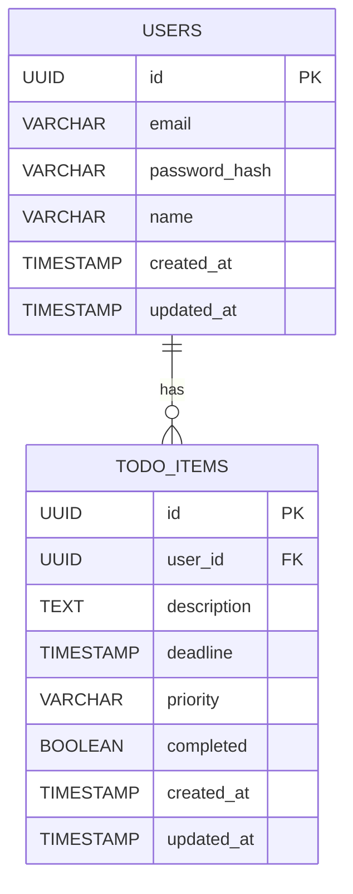
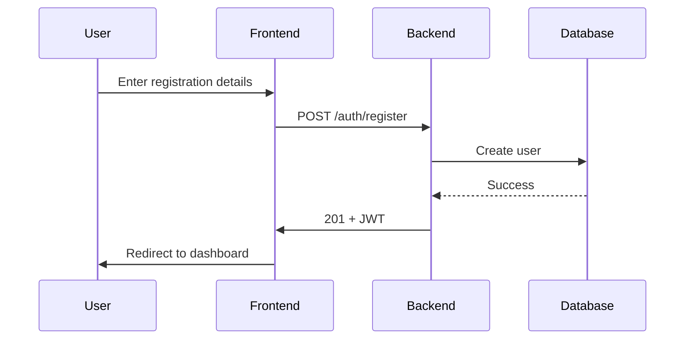
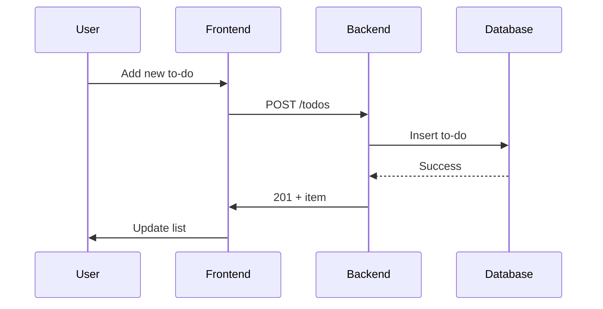

# Low Level Design (LLD) Document - To-Do List Web Application

## Assumptions

> **Note:** The following user experience requirements are assumptions made by the engineering team to ensure a high-quality user experience. These were not explicitly stated in the product requirements and are subject to review and approval by stakeholders.

- Intuitive Interface: Clean, modern design matching provided sketch
- Fast Interactions: Sub-second response times for user actions
- Error Handling: Clear, helpful error messages for all failure scenarios
- Loading States: Visual feedback during data operations
- Accessibility: WCAG 2.1 AA compliance for inclusive design
  - *WCAG 2.1 AA* (Web Content Accessibility Guidelines) is an internationally recognized standard for making web content more accessible to people with disabilities, including those with visual, auditory, motor, or cognitive impairments. Ensuring accessibility is important to provide equal access and usability for all users, improve user experience, and comply with legal and ethical standards.

---

## Table of Contents
1. [Introduction](#introduction)
2. [Database Schema](#database-schema)
    - [Entity-Relationship Diagram](#entity-relationship-diagram)
    - [Users Table](#users-table)
    - [To-Do Items Table](#to-do-items-table)
3. [API Design](#api-design)
    - [Authentication Endpoints](#authentication-endpoints)
    - [To-Do Endpoints](#to-do-endpoints)
    - [Error Response Structure](#error-response-structure)
4. [Backend Component Design](#backend-component-design)
    - [Project Structure](#project-structure)
    - [Authentication Module](#authentication-module)
    - [To-Do Module](#to-do-module)
    - [Validation & Error Handling](#validation--error-handling)
    - [Security Considerations](#security-considerations)
5. [Frontend Component Design](#frontend-component-design)
    - [Component Hierarchy](#component-hierarchy)
    - [Authentication Flow](#authentication-flow)
    - [To-Do List Flow](#to-do-list-flow)
    - [State Management](#state-management)
    - [API Integration](#api-integration)
    - [Validation & Error Handling](#frontend-validation--error-handling)
6. [Integration Points](#integration-points)
7. [Sequence Diagrams](#sequence-diagrams)
8. [Security & Compliance](#security--compliance)
9. [Testing Strategy](#testing-strategy)
10. [Deployment & Configuration](#deployment--configuration)

---

## Introduction

This Low Level Design (LLD) document provides a detailed technical blueprint for implementing the To-Do List Web Application. It covers database schema, API contracts, backend and frontend architecture, validation, error handling, security, and integration details to ensure a robust, scalable, and maintainable solution.

---

## Database Schema

### Entity-Relationship Diagram



### Users Table
```sql
CREATE TABLE users (
    id UUID PRIMARY KEY DEFAULT gen_random_uuid(),
    email VARCHAR(255) UNIQUE NOT NULL,
    password_hash VARCHAR(255) NOT NULL,
    name VARCHAR(255) NOT NULL,
    created_at TIMESTAMP WITH TIME ZONE DEFAULT NOW(),
    updated_at TIMESTAMP WITH TIME ZONE DEFAULT NOW()
);

CREATE INDEX idx_users_email ON users(email);
```

### To-Do Items Table
```sql
CREATE TABLE todo_items (
    id UUID PRIMARY KEY DEFAULT gen_random_uuid(),
    user_id UUID NOT NULL REFERENCES users(id) ON DELETE CASCADE,
    description TEXT NOT NULL,
    deadline TIMESTAMP WITH TIME ZONE,
    priority VARCHAR(20) DEFAULT 'medium' CHECK (priority IN ('low', 'medium', 'high')),
    completed BOOLEAN DEFAULT FALSE,
    created_at TIMESTAMP WITH TIME ZONE DEFAULT NOW(),
    updated_at TIMESTAMP WITH TIME ZONE DEFAULT NOW()
);

CREATE INDEX idx_todo_items_user_id ON todo_items(user_id);
CREATE INDEX idx_todo_items_completed ON todo_items(completed);
CREATE INDEX idx_todo_items_deadline ON todo_items(deadline);
```

---

## API Design

### Authentication Endpoints

#### Register
- **POST /auth/register**
- **Request:**
```json
{
  "email": "user@example.com",
  "password": "securepassword123",
  "name": "John Doe"
}
```
- **Response:**
```json
{
  "success": true,
  "data": { "id": "uuid", "email": "user@example.com", "name": "John Doe" }
}
```

#### Login
- **POST /auth/login**
- **Request:**
```json
{
  "email": "user@example.com",
  "password": "securepassword123"
}
```
- **Response:**
```json
{
  "success": true,
  "token": "<jwt_token>",
  "data": { "id": "uuid", "email": "user@example.com", "name": "John Doe" }
}
```

#### Logout
- **POST /auth/logout**
- **Headers:** `Authorization: Bearer <jwt_token>`
- **Response:**
```json
{
  "success": true
}
```

#### Password Reset (Optional/Future)
- **POST /auth/reset-password**
- **Request:**
```json
{
  "email": "user@example.com"
}
```
- **Response:**
```json
{
  "success": true,
  "message": "Password reset email sent."
}
```

### To-Do Endpoints

#### Get All To-Do Items
- **GET /todos**
- **Headers:** `Authorization: Bearer <jwt_token>`
- **Response:**
```json
{
  "success": true,
  "data": [
    {
      "id": "uuid",
      "description": "Buy groceries",
      "deadline": "2024-01-15T18:00:00Z",
      "priority": "medium",
      "completed": false,
      "created_at": "2024-01-10T10:00:00Z",
      "updated_at": "2024-01-10T10:00:00Z"
    }
  ]
}
```

#### Create To-Do Item
- **POST /todos**
- **Headers:** `Authorization: Bearer <jwt_token>`
- **Request:**
```json
{
  "description": "Buy groceries",
  "deadline": "2024-01-15T18:00:00Z",
  "priority": "medium"
}
```
- **Response:**
```json
{
  "success": true,
  "data": { ... }
}
```

#### Update To-Do Item
- **PUT /todos/{id}**
- **Headers:** `Authorization: Bearer <jwt_token>`
- **Request:**
```json
{
  "description": "Buy groceries and milk",
  "deadline": "2024-01-15T18:00:00Z",
  "priority": "high",
  "completed": true
}
```
- **Response:**
```json
{
  "success": true,
  "data": { ... }
}
```

#### Delete To-Do Item
- **DELETE /todos/{id}**
- **Headers:** `Authorization: Bearer <jwt_token>`
- **Response:**
```json
{
  "success": true
}
```

### Error Response Structure
```json
{
  "success": false,
  "error": {
    "code": "VALIDATION_ERROR",
    "message": "Description is required",
    "details": {
      "field": "description",
      "constraint": "required"
    }
  }
}
```

---

## Backend Component Design

### Project Structure
```
backend/
├── app.py
├── config.py
├── models/
│   ├── __init__.py
│   ├── user.py
│   └── todo_item.py
├── routes/
│   ├── __init__.py
│   ├── auth.py
│   └── todos.py
├── schemas/
│   ├── __init__.py
│   ├── user_schema.py
│   └── todo_schema.py
├── utils/
│   ├── __init__.py
│   ├── jwt.py
│   └── validation.py
├── tests/
│   ├── test_auth.py
│   └── test_todos.py
└── requirements.txt
```

### Authentication Module
- **User registration**: Hash password, validate email, store user
- **Login**: Verify password, generate JWT
- **Logout**: Invalidate token (optional, stateless JWT)
- **Password reset**: Generate and email reset token (future)
- **Token validation**: Middleware for protected routes

### To-Do Module
- **CRUD operations**: Create, read, update, delete to-do items
- **Ownership check**: Ensure users can only access their own items
- **Validation**: Enforce required fields, valid dates, priority values

### Validation & Error Handling
- **Input validation**: Marshmallow schemas for all requests
- **Error handling**: Custom error handler for API responses
- **Logging**: Log errors and important events

### Security Considerations
- **Password hashing**: bcrypt
  - *bcrypt* is a password hashing function designed to be computationally intensive, making it resistant to brute-force attacks. It automatically incorporates a salt (random data) and allows configuration of the number of hashing rounds, further increasing security. Using bcrypt ensures that even if the password database is compromised, attackers cannot easily recover the original passwords.
- **JWT secret management**: Environment variables
- **CORS**: Restrict origins
- **Rate limiting**: Flask-Limiter
- **Input sanitization**: Prevent SQL injection, XSS
- **Data Encryption**: TLS 1.3 for data in transit, AES-256 for data at rest
  - *TLS 1.3* (Transport Layer Security) is the latest standard protocol for encrypting data sent over the internet, ensuring that information exchanged between users and the application cannot be intercepted or tampered with. *AES-256* (Advanced Encryption Standard with 256-bit keys) is a widely used encryption algorithm for securing stored data, providing strong protection against unauthorized access. Using these standards helps safeguard sensitive user data both during transmission and while stored in the database.

---

## Frontend Component Design

### Component Hierarchy
```
App
├── AuthProvider (Context)
├── Router
│   ├── PrivateRoute
│   │   └── DashboardPage
│   │       ├── TodoList
│   │       │   ├── TodoItem
│   │       │   └── TodoForm
│   │       └── UserMenu
│   ├── LoginPage
│   └── RegisterPage
```

### Authentication Flow
- **Login/Register**: Forms with validation
- **Token storage**: Store JWT in memory or localStorage
- **Auth context**: Provide user state and auth actions
- **Protected routes**: Redirect unauthenticated users

### To-Do List Flow
- **Fetch items**: On dashboard load, fetch user’s to-dos
- **Add item**: Show form, validate, POST to API, update list
- **Edit item**: Inline or modal edit, PUT to API, update list
- **Delete item**: Confirm, DELETE to API, update list
- **Mark complete**: Toggle, PUT to API, update list
- **Sort/filter**: UI controls, update displayed list

### State Management
- **React Context**: For auth and global state
- **useReducer/useState**: For local state (to-do list, forms)
- **API calls**: Axios or Fetch, with error handling

### API Integration
- **Service layer**: Abstract API calls
- **Error handling**: Show user-friendly messages
- **Loading states**: Spinners or skeletons during API calls

### Frontend Validation & Error Handling
- **Form validation**: Required fields, email format, password strength
- **Error display**: Inline errors, toast notifications
- **Edge cases**: Expired session, network errors, empty states

---

## Integration Points
- **Email service**: For password reset (future)
- **Hosting/CI**: GitHub Actions for CI/CD, Railway/Heroku for deployment
- **Monitoring**: Sentry for error tracking, logging for backend

---

## Sequence Diagrams

### User Registration


### Add To-Do Item


---

## Security & Compliance
- **HTTPS**: All traffic encrypted
- **JWT**: Short expiry, refresh tokens (future)
- **Password policy**: Min 8 chars, complexity
- **Data privacy**: User data isolation
- **Audit logging**: For sensitive actions
- **GDPR**: Data export/delete endpoints (future)
- **Backup & Recovery**: Automated daily database backups will be performed and stored securely in a separate location from the production database. Backups will be retained for 30 days, allowing for point-in-time recovery in case of data loss or corruption. Disaster recovery refers to the ability to restore the application and its data to a consistent state within 4 hours (RTO) in the event of catastrophic failure, such as hardware failure, accidental deletion, or security breach.

---

## Testing Strategy
- **Unit tests**: Backend (pytest), Frontend (Jest)
- **Integration tests**: API endpoints, user flows
- **E2E tests**: Cypress or Playwright for full flows
- **Test coverage**: >90% for critical modules
- **CI pipeline**: Run tests on every PR

---

## Deployment & Configuration
- **Environment variables**: For secrets, DB URLs, JWT keys
- **Docker**: Containerize backend and frontend
- **Database migrations**: Alembic for schema changes
- **CD/CI**: GitHub Actions for build/test/deploy
- **Monitoring**: Health checks, error tracking
- **Hosting**: The final hosting platform (Railway, Heroku, or AWS) will be selected based on criteria such as cost-effectiveness, ease of deployment, scalability, managed database support, and team familiarity. For MVP and rapid prototyping, platforms like Railway or Heroku may be preferred due to their simplicity and fast setup. For production or scaling needs, AWS may be chosen for its advanced features and flexibility.

---

**End of LLD Document** 